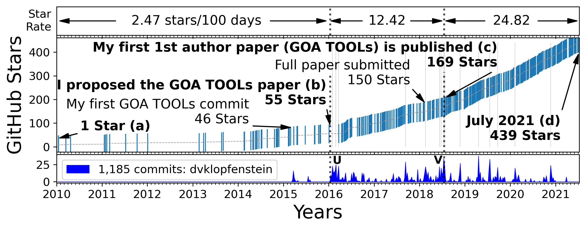

# My Contributions to GOA Tools

## **The amount of researcher interest in GOA TOOLs rose rapidly following the creation of commits by D. V. Klopfenstein starting in 2016.**    

The vertical dotted lines divide all 3 panels in the figure into three time periods.

### The top panel shows the rate of interest of researchers in GOA TOOLs.
The top panel shows the rate of interest of researchers (number of GitHub stars awarded per 100 days) in GOA TOOLs for 3 distinct time periods:

|  Rate | Description
|-------|----------------------------------------------------
|  2.47 | Prior to any major code contributions from me.
| 12.42 | During my major contributions, but before I published the GOA Tools paper.
| 24.82 | During more major contributions after I published the paper.

The rate of appreciation increased fivefold from 2.47 to 12.42 stars per 100 days after
I proposed to the project’s owner, Dr. Haibao Tang, that I write a peer-reviewed research paper centering on GOA TOOLs
and began adding the functionality needed for the paper.

The rate of appreciation doubled from 12.42 to 25.07 stars per 100 days after the publication of the paper for a total tenfoldincrease the original appreciation rating of 2.47.

### The middle panel shows researcher interest rising rapidly starting in 2016
The text and arrows in the middle panel describe key project events.
Each short vertical blue line in the middle panel represents a date when a researcher awarded a star to GOA TOOLs, illustrating their appreciation of the project.
The bold text ending with the letters a, b, c, and d mark consequential events described by the bold text next to each letter.

### The bottom panel shows the code contributions from the principal lead, D. V. Klopfenstein.
The *x*-axis is time in months and years and is shared by all panels.
The *y*-axis of the middle panel is the total number of GitHub stars given to the project, which in spring 2021 was over 400.
The bottom panel shows new features contributed to GOA TOOLs by its top contributor.
The number of commits appears on the *y*-axis. 
The letters U and V indicate periods of commit activity just after I suggested writing the paper (U) and just before the paper was published (V).

Copyright (C) 2015-present, DV Klopfenstein, PhD. All rights reserved.
